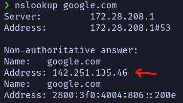

# HTTP: Entendendo a web por baixo dos panos

O HTTP é um protocolo de comunicação entre um cliente, um navegador ou app, por exemplo e um servidor. A sua importancia está em garantir que tanto o servidor como o cliente “falem”a mesma lingua, ou seja, ele garante que a comunicação feita entre as duas pontas respeitem as mesmas regras, para que o servidor consiga entender o que o cliente mandou e que o cliente entenda o que servidor respondeu. A sigla HTTP significa ********HyperText Transfer Protocol********. 

Existem outros protocolos de comunicação na internet, como o P2P, utilizado em aplicativos de Torrent. Nesse tipo de protocolo não há uma divisão clara etnre cliente e servidor, cada cliente desempenha um pouco o papel de servidor e vice-versa. Esse tipo de protocolo é bastante útil quando queremos distribuir um trabalho entre vários clientes ou então baixar um arquivo de várias fontes diferentes ao mesmo tempo. A sigla P2P significa ************peer-to-peer************.

O HTTPS é a junção do HTTP com uma camada adicional de segurança, pois o HTTP trafega texto puro. O que é muito perigoso, pois qualquer intermediário, entre a requisição que mandamos e o servido pode ler o conteúdo do que foi enviado. Uma vez que o nasso comunicação passa pelo roteador, modem, provedor de internet qualquer um que interceptar essa troca de requisições tem acesso a senhas que digitamos ao entrar em contas on-line. Por isso existe o HTTPS que adiciona o SSL/TLS, *********Secure Sockets Layers/Transport Layer Security*********, que é uma camada adicional de segurança/criptografia ao que é trafegado. O padrão SSL é mais antigo, sendo substituido pelo TLS, porém é muito comum ver os dois juntos. 

A segurança dos dados, quando acessamos um site com HTTPS, é garantida por meio de um processo de criptográfia, onde o navegador conhece a chave publica que o site disponibiliza, para criptografar o conteúdo da requisição, que é então enviada pela rede, até o servidor, que realiza então a descriptografa o conteúdo com a chave privada e vice-versa. Essas chaves publicas/privadas nada mais são do que certificados digitais, emitidos por entidades certificadoras reconhecidas pelos navegadores. Podemos ter acesso as informações do certificado digital publico dos sites com a ferramenta de desenvolvedor do nosso navegador, basta ir na aba de segurança e clicar em exibir certificado. Algumas informações, como a entidade certificadora, a data de emissão e expiração do certificado e a chave publica serão exibidas.

A criptografia que utiliza uma chave publica que só serve para criptografar e outra privada que só serve para descriptografar é chamada de criptografia assimétrica, pois uma chave tem mais “poder” do que a outra, essa forma de criptografia é muito lenta, sendo utilizada apenas para estabelecar a primeira comunicação entre o cliente e o servidor. Após esse primeiro contato uma chave simétrica é gerada ao vivo e é enviada, protegida pela criptografia assimétrica. Na criptografia simétrica ambas as chaves podem criptografar e descriptografar o conteúdo das mensagens, essa forma de criptografia é mais rápida. Após o envio da chave simétrica a comunicação entre o servidor e cliente passa a ser feita com essa chave, tornando a troca de mensagens mais rápida.

Os endereços utilizados na web podem ser divididos, inicialmente, em duas grandes partes, o protocolo e domínio, sendo que podemos omitir parte dessas informações. Assim no endereço [https://www.cursos.alura.com.br](https://cursos.alura.com.br), estamos especificando o protocolo https e www.cursos.alura.com.br é o dominio. É comum no dia-a-dia omitir tanto o protocolo como o www, *************world wide web*************, digitando apenas cursos.alura.com.br. Analisando o dominio da direita para a esquerda podemos ver que o top level domain é .br, sendo assim uma página brasileira. Varios outros top level domains são comuns como o .com, .org, .gov, .edu, …, cada uma indicando uma funcionalidade especifica, como sites comerciais, organizacionais, governamentais, educaionais e etc. Esses top level domians também podem ser sub-domínios, como no caso do site da alura, o .com é um sub-domínio.

A idéia de sub-domínios também pode indicar sessões específicas dentro de um mesmo domínio. Um dos casos mais comum de se ver é o da google, que tem como domínio principal o google, mas cada serviço é um subdomínio do principal, como em mail.google.com, drive.google.com, calendar.google.com, translate.google.com, meet.google.com e photos.google.com, sendo mail, drive, calendar, translate, meet e photos, subdomínios do google.

Apesar de usarmos endereços em forma de texto para acessar os diversos sites que visitamos todos os dias, a internet funciona com números IPs. Porém como seria muito complicado ficar gravando o número IP de todo o site que queremos acessar, utilizamos um serviço chamado DNS, ******Domain Name System******, para traduzir o nome do site que queremos para o IP do site. Dessa forma, quando tentamos acessar um site, primeiro uma requisição com o endereço do site é feita para um servidor DNS, que nos retorna o IP do endereço que queremos acessar para só então fazermos a requisição para o site em si. Podemos verificar o endereço IP de alguns sites com o comando `nslookup`.

Além do domínio, poderiamos também especificar a porta que qeremos acessar do servidor em questão, mas como já esxitem portas padrão para o protocolo HTTP e HTTPS, isso não é necessário, podemos omitir essa informação que o navegador se encarrega de usar a porta correspondente. A porta padrão para HTTP é a 80 e para HTTPS é a 443. Se tentarmos acessar um servidos com a porta errada, essa porta provavelmente estará fechada e o navegador não conseguirá se conectar, apresentado um erro de timeout. Quando estou transferindo arquivos para os servidores da universidade usando o ftp a porta padrão é a 21 e para o acesso com o ssh é a 22.

Finalizando a construção do nosso endereço/URL temos o recurso que queremos acessar, essa é aquela parte depois da barra `/`, assim o endereço https://www.cursos.alura.com.br:433/dashboard, posui o protocolo HTTPS, o domínio www.cursos.alura.com.br, a porta 433 e está acessando o recurso dashboard desse site.

URI, ***************************Uniform Resource Identifier***************************, e URL, **************Uniform Resource Locator**************, são siglas parecidas, porém um pouco diferente. Para a utilização no dia-a-dia, as duas podemos tratar as duas como sinônimos, representando endereço na web. Contudo uma URL é uma URI, mas uma URI não necessariamente é uma URL. As URL identificam um recurso através de um endereço, porém existem URIs que identificam um recurso sem especificar um endereço. Assim como também exitem URN, *********************Uniform Resource Name*********************, que também é uma URI. Com URN identidicamos os recursos, mas o endereço está em outro formato `urn:cursos:alura:dashboard`.

Uma requisição HTTP/HTTPS é stateless, ou seja, ela não guarda informações entre uma requisição e outra, fazendo com que seja necessário enviar todas as informações a cada requisição. Como isso não seria muito prático, principalmente quando envolvemos informações sensíveis como login e senha o servidor gera um hash de identificação para o usuário quando ele efetua o login e devolve esse hash na resposta da requisição. Esse hash é então armazenado em um cookie que dura até a sessão se encerrar. Dessa forma ao fazer novas requisições para o servidor, o navegador não envia as informações de login e senha, mas sim esse hash que serve para identificação. Cada sessão dura o tempo que o usuário fica ativo/utiliza o serviço na web. Quando fechamos a janela, ou fazemos logoff encerramos a sessão e o cookie passa a não ter mais validade.

Um cookie nada mais é do que um arquivo de texto criado por uma aplicação web com o intuíto de guardar alguma informação de um usuário. Essa informação depende da aplicação e pode ser desde preferências do usuário, carrinho de compras, identificação de usuário e etc. Cookies podem ser manipulados e deletados de acordo com a vontade do usuário, sendo que quando são salvos, eles ficam associados a um domínio específico, dessa forma um domínio não tem acesso ao cookie de outrs domínios.

Podemos usar o próprio navegador para fazer uma depuração das nossas requisições HTTP, basta abrir a parte de desenvolvedor/inspecionar pagina e ir na aba network para visualizar todas as requisições que o nosso browser está realizando. Nessa aba é possível visualizar tanto os requests como as responses. É comum o navegador realizar várias requisições diferentes, uma para cada recurso necessário para renderizar a página. Normalmente, uma das primeiras a serem carregadas e que serve como gatilho para as demais é o arquivo HTML. Conforme o browser vai processando o HTML ele vai disparando outras requisições a medida que o HTML vai necessitando de recursos, como arquivos CSS, SVG, JavaScript e etc.

Uma das informações que podemos obter com a depuração das requisições são os ***********Status Code***********, que se dividem em algumas “famílias”, e servem para nos dar uma resposta de como a requisição foi processada. Entre as mais importantes familias temos 2XX, que representa sucesso no processamento da requisição, 3XX, representa o redirecionamento da requisição, 4XX, representa que houve um erro no processamento da reuisição ocasionado pelo cliente e 5XX que também representa um erro na requisição, mas dessa por conta do server. Dentro dessas familias os mais comuns são:

| 200 OK | Requisição ok, é a resposta padrão para o sucesso do preocessamento HTTP |
| --- | --- |
| 201 Created | Requisição processada e recurso criado |
| 202 Accepted | Requisição aceita, mas o processamento ainda não terminou |
| 203 Non-Authoritative Information | Requisição processada, mas a resposta pode ter vindo de outra fonte |
| 204 No Content | Requisição processada, mas não há nada para serdevolvido |
| 301 Moved Permanently | A URL que você tentou acessar foi modificada permanentemente para outra URL. Retorna a nova URL |
| 302 Found | A URL foi movida temporariamente |
| 400 Bad Request | A reuisição não pode ser completada devido a falha na sintaxe |
| 401 Unauthorized | A requisição foi aceita, porém o servidor se recusa a responder devido a falta de autenticação |
| 403 Forbidden | Reuisição legitima, mas o servidor se recusa a responder |
| 404 Nou Found | A pagina que você tentou acessar não existe |
| 500 Internal Server Error | Mensagem de erro genérica que é apresentada quando o servido não pode apresentar uma resposta melhor |
| 501 Not Implemented | O servidor não reconhece o método de reuest, ou não tem as habilidades necessárias para completar a requisição |
| 503 Service Unavailable | O servido está atualmente indisponível, ou supercarregado, ou offline |

Quando vamos utilizar os métodos GET e POST para enviar os parâmetros de uma requisição precisamos tomar cuidado com a forma como isso é feito, pois com o método GET, os parâmetros são enviados como parte da URL. Essa normalmente é a escolha quando não estamos trabalhando com informações sensíveis e queremos que o reseltado de daquela requisição possa ser facilmente replicado, uma vez que basta enviar a mesma URL que teremos a mesma resposta. Os parâmetros nesse caso são passado depois de um interrogação no formato chave=valor e são separados com o simbolo &. Então a URL exemplo.com/?search=curso&duration=10 tem como parâmetros ?search=curso&duration=10, sendo que o primeiro parâmetro é search que tem como valor curso e o segudo parâmetro é duration que tem como valor 10.

Já quando precisamos realizar uma requisição, onde não queremos expor na URL os parâmetros que estamos enviando devemos utilizar o método POST, pois com esse método devemos enviar no corpo da requisição, sendo assim mais seguro para o envio de usuário e senha, por exemplo.

Podemos realizar requisições HTTP de qualquer aplicativo/software que entenda o protocolo. Isso é muito útil, pois não limitamos nossa aplicação a rodar dependendo apenas de um browser/navegador, podendo acessar suas funcionalidade em outros lugares, porém uma resposta em HTML não é a coisa mais prática para um aplicativo processar. No caso desses web-apps é comum que a resposta seja enviada formatos como JSON ou XML, onde as informações estão classificadas de forma hierarquica e de fácil varredura. Para solicitar que a resposta da requisição seja um XML ou JSON, no cabeçalho da requisição devemos especificar o formato com a opção “Accept: application/json” ou “Accept: application/xml”. Outros formatos que também podem ser especificados são: “Accept: text/html”, “Accept: text/css”, “Accept: image/jpeg”, podemos também não definir nenhum formato “Accept: */*”

Esse conjunto de Recurso, que é a URI que estamos acessando, Operações, que são os métodos que podemos utilizar para interagir com nosso Recusro, como GET, POST, PUT, PATCH. DELETE e a forma ou REPRESENTAÇÃO de com como esse Recurso é transportado, tudo isso seguindo um conjunto de boas práticas são a base do modelo de arquitetura conhecido como REST(REpresentational State Transfer) que é a base de web-services.

Com a evolução da web o protocolo HTTP precisou ser modernizado também, pois com o crescimento dos dispositivos móveis, onde tanto a velocidade de conexão é menor, como a quantidade de dados que podem ser trafegados é baixa as requisições precisavam se tornarem mais eficientes, por isso que na versão 2 do HTML algumas modificações no formato da requisição e da resposta mudaram um pouco. Por padrão o contéudo da resposta de uma requisição é trafegado no formato gzip, que por ser um formato comprimido não onera tanto a conexão, e tanto o cabaçalho da requisição, como o da resposta são trafegados em formato binário, passando por um algoritmo de compressão chamado HPACK e depois encriptografado com o TLS, tornando assim as conexões muitos mais rápiadas e seguras.

Apesar de o HTML ser stateless, com o HTTP2, os cabeçalhos de requisição podem se aproveitar do HPACK para guradarem algumas informações, fazendo com que não seja necessário repetir as informações já enviadas no cabeçalho anterior, caso você queira reutiliza-las. Por exemplo, na primeira requisição eu informei meu navegador, o host, quais linguagens eu aceito e qual o formato que eu espero como resposta, HTML por exemplo. Quando que for enviar uma segunda requisição para buscar pelo arquivo css por exemplo que está no mesmo caminho daquela minha primeira requisição, eu não preciso reenviar as informações do navegador, do host e da linguagem que eu aceito, posso mandar apenas o formato que eu espero como respota, agora não mais um Accept: text/hmtl e sim um Accept: text/css. Isso acaba economizando banda de conexão, uma vez que não reenviamos informações que já foram enviadas anteriormente.

Outra funcionalidade do HTTP2 é o Server Push. Com esse funcionalidade o servidor já antecipa a ação do cliente de realizar várias requisições subsequentes a primeira para carregar conteúdos necessário para renderizar a página por completo enviando esses conteúdos junto com a primeira resposta, assim a renderização da página fica mais rápida, pois o cliente não precisa ficar aguardando a resposta de cada requisição nova com conteúdos complementares.
